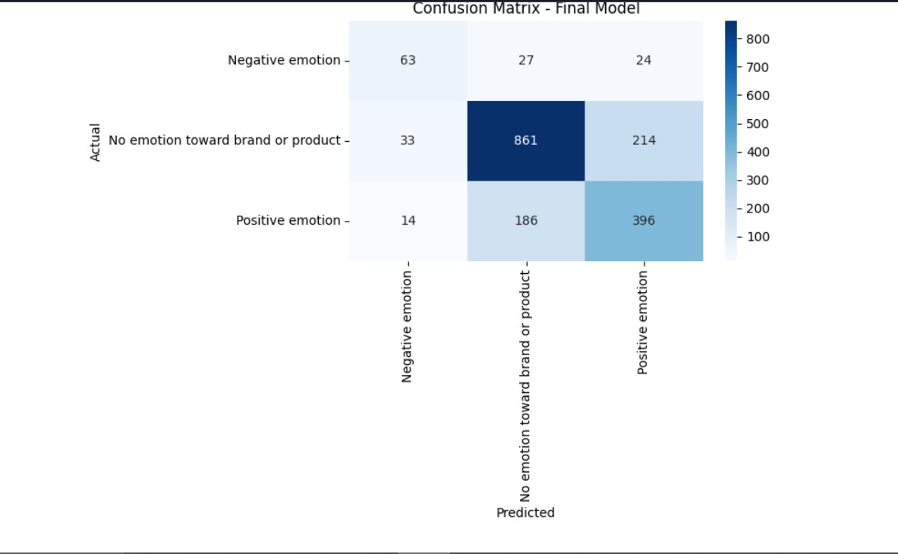

# BrandPulse: Decoding SXSW Sentiment for Competitive Intelligence

## Overview
In this project, we analyze customer sentiment toward various products and companies using a Twitter-based dataset titled **“judge-1377884607_tweet_product_company.”**
The dataset contains tweets mentioning specific companies, product categories, and corresponding sentiment labels, making it useful for understanding customer perception and brand performance.

Using data cleaning, text preprocessing, feature engineering, sentiment visualization, and exploratory analysis, we identify key factors that influence public opinion across different companies and products. Our analysis reveals which brands receive the most positive or negative sentiment, the products associated with the highest complaint volumes, and the common themes in customer feedback.

The insights from this project help businesses understand how customers perceive their products on social media and guide data-driven decisions in marketing, product improvement, and customer experience strategy. We conclude with three actionable recommendations based on sentiment patterns that can help companies improve brand reputation and strengthen customer satisfaction

## Business Understanding:
In the digital era, customers constantly express opinions on social media, especially on platforms like Twitter. These posts reveal how people feel about brands, their products, and their customer experience.
Companies increasingly rely on sentiment analysis to monitor public perception, identify dissatisfaction early, and guide marketing, product design, and support decisions.

The **“judge-1377884607_tweet_product_company”** dataset fits into this real-world business need. It contains tweets, the product mentioned, and the company associated with each tweet. Most versions of this dataset also include or infer sentiment labels (positive, negative, or neutral).

### Problem Statement
Brands invest massive resources in marketing at major events like SXSW, but they lack a real-time, data-driven understanding of public perception. They struggle to answer:

- Is our campaign resonating positively?
- How does sentiment towards our brand compare to our competitors?
- What specific product features or marketing stunts are people talking about (good or bad or neutral)?

### Stakeholders
**1. Marketing Directors at Tech Companies (e.g., Apple, Google):**

“Do we double down on this activation or cut our losses?”
“Which competitor is heating up right now?”
“What messaging is actually resonating with the audience?”
2. Brand Strategy Consultants:

"Need actionable competitive intelligence for client advising."

“What is our true position vs competitors?”
“What emerging trends should we capitalize on?”
“Where are the market gaps we can own?”
3. For a CMO After SXSW

“What should we change for next year?”
“How should we allocate our next event budget?”

### Value Proposition
BrandPulse analyzes social media chatter from SXSW to provide quantified brand sentiment and competitive positioning, enabling evidence-based marketing decisions.

## Data Understanding
We use the **“judge-1377884607_tweet_product_company”** dataset, which contains tweets mentioning different companies, products, and their associated sentiment labels. Each row includes the tweet text, the company referenced, the product category, and whether the sentiment is positive, negative, or neutral.

Because the data comes from social media, it requires preprocessing such as text cleaning, removing noise (links, hashtags, punctuation), and preparing the text for analysis and modeling. This dataset allows us to explore customer opinions, compare sentiment across companies and product types, and identify patterns that can guide business decisions in marketing and customer experience.

## Data Preparation
1.Handled missing values
Ensured all records were complete and usable for modeling.

2. Cleaned text (lowercasing, removing punctuation, and stopwords)
Reduced noise and standardized the text for better vectorization.

3. Tokenized and lemmatized text
 Reduced vocabulary size by converting words to their base forms.

4. Encoded target labels
Converted categorical emotion labels into numeric format for modeling.

5. Performed stratified train–test split
Preserved class balance in both training and testing sets.

6. Applied TF-IDF vectorization
Transformed text into meaningful numerical features for ML models.

7. Applied SMOTE
Balanced minority classes to improve model performance on underrepresented labels.

8. Scaled features 
Improved convergence and stability for the neural network model.

**Key Business Insight**
Since positive sentiment dominates, brands can leverage this for marketing amplification and customer engagement campaigns.
The concentration of tweets in the mid-length range indicates that content strategies should target concise yet informative messaging to match natural user behavior.
Monitoring tweets for negative sentiment, even if less frequent, is important for brand reputation management.

## Data Modelling
We transformed text entries into features that machine learning models can understand, such as TF-IDF vectors or embeddings and selecting models capable of learning patterns that indicate the emotion behind each tweet. Below are some of the models we used;

### 1. Logistic Regression (`sklearn.linear_model.LogisticRegression`)
- Simple and interpretable linear model.
- Performs well on high-dimensional sparse data, like text after vectorization (TF-IDF or CountVectorizer).
- Efficient for baseline classification and gives a quick benchmark for performance

### 2. Random Forest Classifier (`sklearn.ensemble.RandomForestClassifier`)
- Ensemble tree-based method, good for capturing non-linear patterns.
- Robust to noise and overfitting, useful if tweet features (like n-grams or sentiment scores) are complex.
- Provides feature importance, which can help understand which words or features drive predictions.

### 3. Neural Network (`keras.Sequential with dense layers`)
- Can model complex, non-linear relationships in the data.
- Flexible architecture allows combining multiple features (e.g., embeddings, TF-IDF).
- Suitable if you want the model to learn interactions between words automatically, potentially improving accuracy over linear models.

### 4. BERT
- Pre-trained deep learning model designed to understand contextual relationships in text.
- Captures subtle nuances in language by processing text bidirectionally, considering both left and right context.
- Particularly effective for short, informal text like tweets, improving emotion classification by leveraging semantic understanding beyond simple word counts.
- Can be fine-tuned on your dataset for state-of-the-art performance in classification tasks.

## Results
**1. Logistic Regression**
- Macro F1 = 0.55 
- The model correctly predicts 68% of the test samples which is better than the baseline model.
- Logistic Regression tuning helps, but the model still struggles with minority classes.

**2. Random Forest Classifier**
- Macro F1 = 0.55  average performance across all classes.
- Accuracy = 0.65  correct predictions for about two-thirds of test samples.
- Shows Random Forest can leverage TF-IDF features to capture text patterns across classes.

**3. Neural Network**
- Accuracy = 0.67
-	Performs similarly to the Random Forest
-	Suffers from class imbalance

**4. BERT**
- Accuracy = 0.72
- Macro F1 = 0.67
- The BERT model achieves an accuracy of 0.72 and a macro F1 score of 0.67, outperforming previous models on all sentiment classes. This indicates the model reliably predicts negative, positive, and neutral emotions toward the brand, showing strong generalization and balanced performance across classes.

**Model Selection** Bert was our best performing model hence we chose it.

## Business Insights and Competitive Analysis
### Accuracy by Sentiment Class
**1. Negative Emotion**
- Total actual negatives: 114
- Correctly identified: 58 (50.9%)
- Misclassified as Neutral: 31 (27.2%)
- Misclassified as Positive: 25 (21.9%)
**Business meaning:** The model catches about half of all negative comments; the rest are softened into neutral or positive sentiment.

**2. Neutral (No Emotion Toward Brand/Product)**
- Total actual neutral tweets: 1,108
- Correctly identified: 863 (77.9%)
- Misclassified as Negative: 35 (3.2%)
- Misclassified as Positive: 210 (18.9%)
**Business meaning:** Neutral detection is strong, forming a reliable backbone for general sentiment tracking.

**3. Positive Emotion**
- Total actual positives: 596
- Correctly identified: 395 (66.3%)
- Misclassified as Neutral: 185 (31.0%)
- Misclassified as Negative: 16 (2.7%)
**Business meaning:** Positive sentiment is captured reasonably well, but nearly one-third is diluted into neutral.

## Business Impact
### Positive Business Impact
High reliability for neutral sentiment (77.9% correct) gives an accurate view of brand mentions and general engagement.
Two-thirds of positive sentiment detected correctly (66.3%) supports tracking customer delight and campaign uplift.
The model provides a strong baseline for:
- Brand health measurement
- Customer satisfaction trends
- ROI analysis for marketing activities
- Benchmarking conversation volume

### Areas of Risk
- Positive sentiment is understated (31% shifted to neutral), potentially undervaluing successful campaigns.
- Negative sentiment is underdetected (only 50.9% caught), which can delay reaction to customer pain points.

## Recommendations
- Add emotional signals (emoji analysis, polarity scoring).
- Consider an ensemble to stabilize sentiment predictions.
